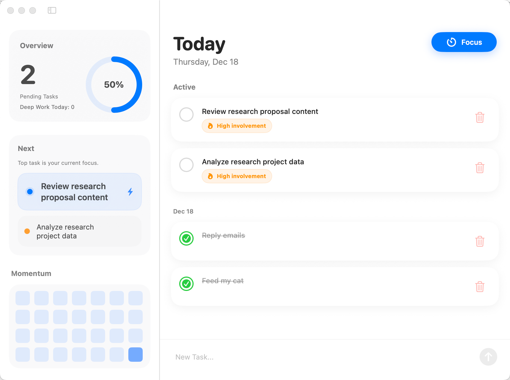
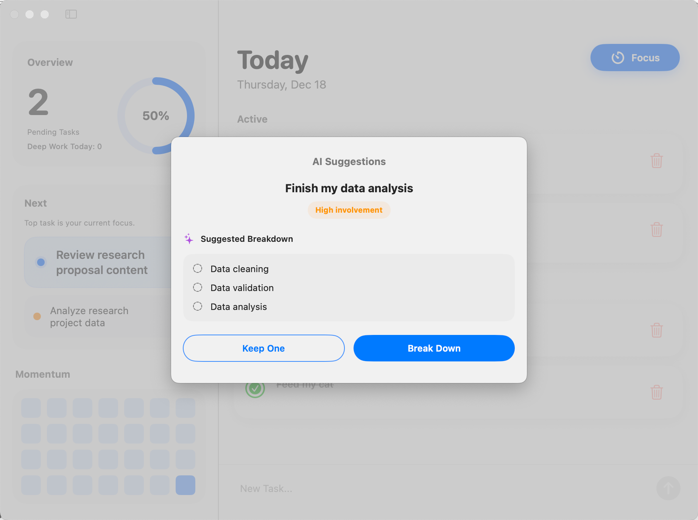

# Done
<p align="center">
  
</p>

Done is a lightweight SwiftUI todo app for people who often feel stuck on a task because the “one thing to do” is actually too big.

When a task is too ambitious, it’s easy to procrastinate, feel frustrated, and end the day with nothing checked off. Done helps by encouraging smaller, clearer steps. It can use a **local LLM (Ollama)** to suggest a difficulty level and a short breakdown into subtasks, so you can start with something doable.

The UI stays intentionally minimal. No complex project structures, no heavy planning system, just a list you can reorder and finish.

<p align="center">
  
</p>

## Features
- ✅ Create, edit, complete, and delete tasks
- ↕️ Drag to reorder active tasks
- 🧠 Optional local AI suggestions (involvement flag, break big tasks up to 3 subtasks) via Ollama
- 🔥 Focus mode tomato timer with “sessions today”
- 📈 Sidebar momentum heatmap (completed todos by day, last 28 days)

<p align="center">
  
</p>

## Tech stack
- SwiftUI
- SwiftData (`@Model`, `@Query`)
- Optional: Ollama local server (`http://localhost:11434`)

## Requirements
- Xcode 15+ (SwiftData)
- iOS 17+ or macOS 14+

## Run
1. Open `Done.xcodeproj` in Xcode
2. Select a target (iOS Simulator or macOS)
3. Build & Run

## Optional but highly suggested: Local AI suggestions (Ollama)
Done can call a local Ollama instance to analyze a task title and propose a smaller breakdown. Small model is generally recommended. Here it uses Qwen3-0.6B for planning.

1. Install Ollama
2. Start the model used in code:
```bash
ollama run qwen3:0.6b
````

3. Confirm the Ollama API is available:

* `http://localhost:11434/api/generate`

If Ollama is not running, the app still works. The “AI suggestions” step will simply return nothing and you can add tasks manually.
